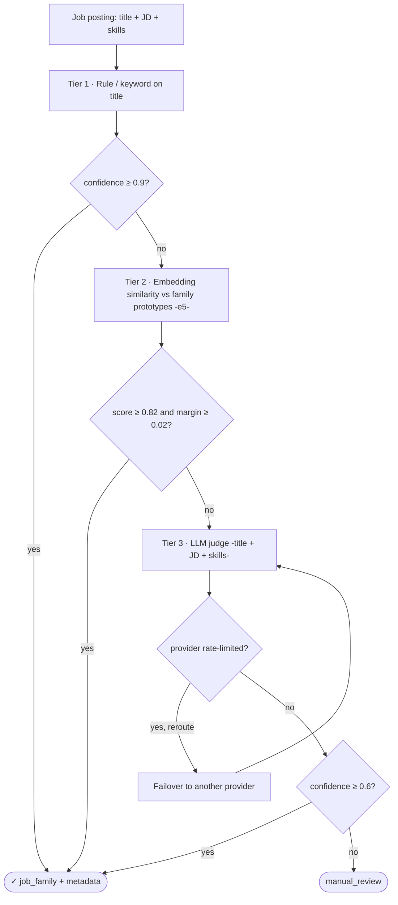
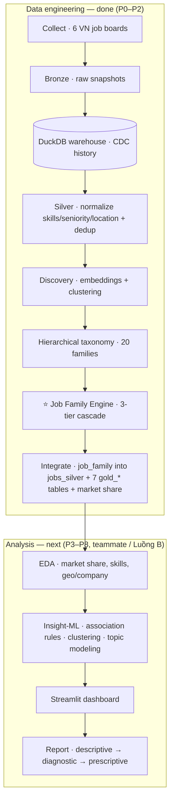

# Vietnam Data Job Market Analysis

> A **Data-Analyst** project that crawls Vietnamese **Data / IT job postings**, gives every posting a
> reliable **job family** label, and mines the market for **insight**: which roles hire most, which
> skills are in demand, how cities and company types differ, and what a job seeker should learn.

**Authoritative roadmap:** [`MASTER_PLAN.md`](MASTER_PLAN.md) · **handoff/status:** [`PROJECT_STATUS.md`](PROJECT_STATUS.md) · **who-does-what:** [`WORK_DIVISION.md`](WORK_DIVISION.md)

---

## 1. The problem

Vietnamese job boards advertise thousands of "data" roles, but the market is **impossible to read
directly** because there is **no standard role label**:

- **Titles are inconsistent and bilingual** — `Data Engineer`, `Kỹ sư dữ liệu`, `Chuyên viên phân tích`,
  `AI/Automation Engineer`, `Senior Sales Performance Analyst`… the same job wears many names.
- **Many data roles never say "data"** in the title (a BI developer titled "Reporting Specialist",
  a risk analyst, an ML engineer titled "AI Engineer").
- **Generic titles are ambiguous** — `Specialist`, `Executive`, `Consultant`, `Officer` tell you nothing
  on their own.

So before you can answer *any* market question, you must first solve one thing: **what job family does
each posting actually belong to?** That label is the key every downstream analysis depends on.

**Questions this project answers** (once every job is labeled):
1. **Market share** — what % of the data market is each family (Data Analyst, BA, Data Engineer, AI…)?
2. **Skills demand** — which skills/tools each family needs, and which combos to learn together.
3. **Comparisons** — how demand differs by city (HN / HCM / ĐN), company type (product / outsourcing / bank), seniority.
4. **Guidance** — concrete "what should I learn for role X" takeaways.

> **Out of scope (by design):** no salary (not in the data), no LinkedIn, no demand forecasting (only one
> snapshot so far). This is **data analytics for insight**, not a prediction/ML product.

---

## 2. The core component — Job Family Labeling Engine ⭐

Because titles alone are not enough, the heart of the project is a **standalone, reusable labeling
engine** (`job_family_engine/`) that reads **title + job description + skills** and assigns a
**hierarchical job family** (`Domain → Sub-domain → Family`, 20 families) with confidence + provenance.

It is a **3-tier cascade** — cheap & precise first, expensive only for the hard remainder:



- **Tier 1 — Rules** (YAML config, title only): high-precision keyword/alias match, accept at conf ≥ 0.9.
  Resolved **527 jobs (~31%)**.
- **Tier 2 — Embedding similarity**: multilingual-`e5` cosine between the job and each family prototype;
  accept only when the top match is confident **and** clearly ahead of the runner-up. Resolved **58 jobs**.
- **Tier 3 — LLM with dynamic failover**: for the hard remainder, **one judge per job** routed across
  **6 free-tier providers** (Groq, Cerebras, Mistral, OpenRouter, Gemini). A provider that hits its
  rate/daily limit is marked exhausted and its jobs are **automatically rerouted** to one with capacity,
  so the run never stalls; every answer is **disk-cached** so reruns are free and resumable. Resolved
  **1116 jobs**. *(Multi-judge voting is supported and modular, but a single strong judge per job is used
  at scale to fit free-tier limits — see [`docs/TAXONOMY.md`](docs/TAXONOMY.md).)*

Output per job: `domain, subdomain, job_family, confidence_score, labeling_method, llm_votes, reasoning,
review_status, taxonomy_version`. API: `engine.predict(job)`.

---

## 3. End-to-end pipeline



Everything in **Data engineering (P0–P2)** is done and shipped in `data/warehouse.duckdb`. Everything in
**Analysis (P3–P8)** is the remaining work for the analysis teammate — see [`WORK_DIVISION.md`](WORK_DIVISION.md).

---

## 4. Results (P2)

**1,701 postings labeled, 100% resolved, 0 manual-review.** Spot-check: the stratified sample
(`data/labeling/spot_check.csv`) was reviewed by hand and found **correct across all families**.

**Market share** over the **852** active Data/AI postings (non-OTHER, deduped):

| Family | Share | | Family | Share |
|---|--:|--|---|--:|
| Business Analyst | 21.2% | | BI Analyst/Dev | 5.0% |
| Data Engineer | 17.5% | | Data Scientist | 3.9% |
| Data Analyst | 14.7% | | Data Governance | 3.3% |
| AI Engineer | 13.8% | | Product Analyst | 2.7% |
| Risk/Fraud Analyst | 6.1% | | Data Leadership | 2.7% |

…and 10 smaller families (DBA, CV/NLP, ML Engineer, Data Architect, GenAI/LLM, Analytics Engineer,
Research Scientist, DataOps, MLOps, Big Data Engineer). Full breakdown: [`docs/labeling_kpi.md`](docs/labeling_kpi.md),
taxonomy: [`docs/TAXONOMY.md`](docs/TAXONOMY.md).

---

## 5. Sources (per snapshot, ~1,700 distinct postings, full JD)

| Source | ~Count | Access |
|---|--:|---|
| VietnamWorks | 790 | public JSON API |
| CareerViet | 382 | server-rendered HTML |
| ITviec | 286 | HTML via ScraperAPI |
| TopCV | 99 | Cloudflare → Claude-in-Chrome |
| TopDev | 82 | JSON API (robots-override, personal use) |
| Glints | 62 | GraphQL |

Responsible scraping: robots.txt, randomized 3–8s delays, UA rotation, raw cache, credit guard.

---

## 6. Repo layout

```
pipeline/            ingest/ · transform/ (load·silver·gold) · dataset/ (discovery + LLM clients) · utils/ · __main__.py (CLI)
job_family_engine/   taxonomy/taxonomy_v1.yml · rules.py · embed_match.py · llm_judge.py ·
                     engine.py (dynamic-failover cascade) · evaluate.py (KPIs) · integrate.py (→ silver + Gold)
ref/                 reference dictionaries (skills, seniority, company type) + taxonomy/
docs/                DATA_DICTIONARY.md · TAXONOMY.md · quality_report.md · labeling_kpi.md
analysis/            EDA + insight-ML (P4–P5, teammate)        dashboard/  Streamlit app (P7)
tests/               pytest (45 tests)
data/                warehouse.duckdb IS shipped (the data layer); raw/bronze/labeling/dataset gitignored
```

---

## 7. Quick start

```bash
python -m pip install -e ".[dataset]"      # deps (incl. embeddings + LLM clients)
cp .env.example .env                        # ScraperAPI + LLM keys — only needed to (re)build the data

# Rebuild the data layer from scratch (needs keys + time), OR just use the shipped warehouse (§8):
python -m pipeline scrape                   # crawl → bronze
python -m pipeline enrich --source <src>    # fill JD where listing-only
python -m pipeline load                     # bronze → warehouse (incremental CDC)
python -m pipeline silver                   # normalize + dedup → jobs_silver
python -m pipeline discover                 # embeddings + clusters (feeds Tier-2)
python -m pipeline label                    # ⭐ Job Family Engine → job_family.parquet (resumable)
python -m pipeline label-kpi                # labeling KPIs + spot-check sample
python -m pipeline integrate                # job_family → jobs_silver + 7 gold_* tables + market share
python -m pytest -q                         # 45 tests
```

## 8. For the analysis teammate (Luồng B — P3+)

The repo **ships `data/warehouse.duckdb`** (13 MB) — already containing the labeled **`jobs_silver`**
(`job_family`, `jf_domain`, `jf_subdomain`, `jf_confidence`) and all **7 `gold_*`** tables — so you can
start analysing right after cloning, **no rebuild needed**:

```python
import duckdb
con = duckdb.connect("data/warehouse.duckdb", read_only=True)
con.sql("SELECT job_family, n, pct FROM gold_market_share ORDER BY n DESC").show()
con.sql("SELECT * FROM jobs_silver WHERE job_family <> 'OTHER' LIMIT 5").show()
```

Your work keys off `jobs_silver.job_family` + the `gold_*` tables — you do **not** need the engine
internals. Read [`WORK_DIVISION.md`](WORK_DIVISION.md) for the split and
[`docs/DATA_DICTIONARY.md`](docs/DATA_DICTIONARY.md) for every column.
*(Note: the warehouse also holds raw scraped JD in the `jobs` table — keep repo access controlled.)*

---

## 9. Design decisions (why it's built this way)

- **Label first, analyse second.** No standard role label exists, so labeling is the gate for every
  insight — hence a dedicated, reusable engine rather than ad-hoc title rules (the old rule label was
  ~27% contaminated).
- **3-tier cascade for cost.** Rules and embeddings (free, local) resolve ~34% of jobs; the LLM is spent
  only on the genuinely ambiguous remainder.
- **Single judge + failover, not voting.** Free-tier rate/daily limits cannot sustain N-judge voting over
  ~1,700 jobs; dynamic failover gives throughput + resilience, and the disk cache makes runs resumable.
  Voting stays modular for anyone who wants it.
- **Hierarchical taxonomy** lets sparse families (MLOps, DataOps…) roll up to a sub-domain/domain for
  statistically meaningful aggregates.
- **Constraints:** no salary · no LinkedIn · no forecasting (1 snapshot) · VN + Data only · secrets only
  via `.env`. A Data-Analytics project, **not** an ML/MLOps product.
