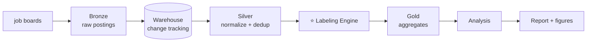
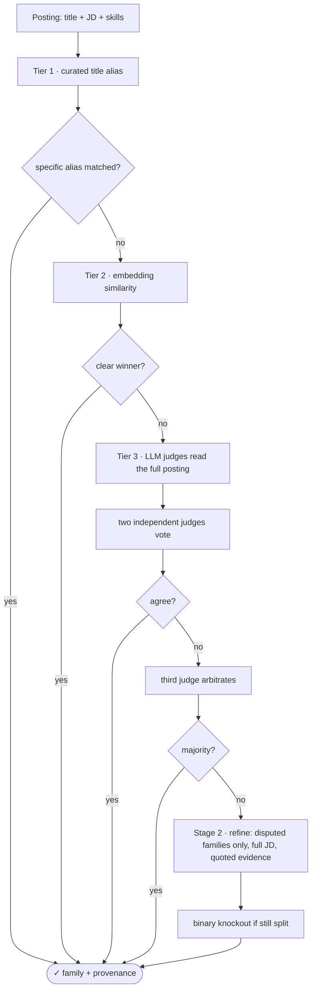

# Vietnam Data Job Market Analysis

> Crawls Vietnamese **data / IT job postings**, gives every posting a reliable **job-family label**, then
> mines the labelled corpus for insight: which roles hire most, which skills go together, and how demand
> differs by city, industry and seniority.

The labelled warehouse ships in this repo — clone and start querying, no rebuild and no API keys.

---

## 1. The problem

Job boards advertise thousands of "data" roles, but the market cannot be read directly, because there is
no standard role label:

- **Titles are inconsistent and bilingual** — the same job wears many names, in two languages.
- **Many data roles never say "data"** — a BI developer titled "Reporting Specialist", an ML engineer
  titled "AI Engineer".
- **Generic titles say nothing** — *Specialist*, *Executive*, *Consultant*.
- **And the reverse trap** — plenty of postings that *do* say "Analyst" are software or ERP work with no
  data in them.

So before any market question can be answered, one must be answered first: **what job family does each
posting actually belong to?** Every downstream number depends on that label, which is why most of the
engineering sits there rather than in the charts.

**Out of scope by design:** no salary (the boards do not expose it), no LinkedIn, no forecasting (a single
snapshot cannot support a trend). This is analytics for insight, not a prediction product.

---

## 2. Approach

A conventional medallion pipeline with one unusual component in the middle: a standalone **Job Family
Labeling Engine**. Everything upstream feeds it clean text; everything downstream trusts its output.


```mermaid
flowchart LR
    C[job boards] --> B[Bronze<br/>raw postings]
    B --> W[(Warehouse<br/>change tracking)]
    W --> S[Silver<br/>normalize + dedup]
    S --> JE[⭐ Labeling Engine]
    JE --> G[Gold<br/>aggregates]
    G --> A[Analysis]
    A --> R[Report + figures]
```

| Layer | Job |
|---|---|
| **Bronze** | Raw postings exactly as crawled |
| **Warehouse** | Upsert with change tracking — first seen, last seen, removed |
| **Silver** | Normalize skills / seniority / location / employer; drop cross-source duplicates |
| **Labeling engine** | Assign `Domain → Sub-domain → Family` with confidence and provenance |
| **Gold** | Pre-aggregated tables, so analysis never re-derives the population filter |
| **Analysis** | Market share, skill profiles, association rules, clustering, topic modeling |

---

## 3. The labeling engine

Three tiers: cheap and narrow first, expensive only for the genuinely ambiguous remainder.


```mermaid
flowchart TD
    T[Posting: title + JD + skills] --> R[Tier 1 · curated title alias]
    R --> RC{specific alias matched?}
    RC -- yes --> DONE([✓ family + provenance])
    RC -- no --> E[Tier 2 · embedding similarity]
    E --> EC{clear winner?}
    EC -- yes --> DONE
    EC -- no --> L[Tier 3 · LLM judges read the full posting]
    L --> V1[two independent judges vote]
    V1 --> AG{agree?}
    AG -- yes --> DONE
    AG -- no --> V3[third judge arbitrates]
    V3 --> MAJ{majority?}
    MAJ -- yes --> DONE
    MAJ -- no --> RF[Stage 2 · refine: disputed families only, full JD, quoted evidence]
    RF --> KO[binary knockout if still split]
    KO --> DONE
```

**Tier 1 — title aliases.** Matches a hand-curated list of unambiguous title phrases. It never reads the
job description, so it is the weakest tier by construction and the alias list is kept deliberately narrow —
broad phrases were removed after they pulled generic banking and market-research roles into data families.

**Tier 2 — embedding similarity.** Accepts only when one family wins clearly: a high cosine score **and** a
real gap to the runner-up. Both thresholds were raised after an audit — at the original gap the winner beat
the runner-up by about the width of floating-point noise, and the labels it accepted included obvious
nonsense. Tightened, this tier now accepts almost nothing, which is the honest outcome: ambiguous postings
should fall through to a tier that reads the description.
**The general lesson: a cheap tier must be narrow, not merely cheap.** One that short-circuits with a guess
is worse than no tier at all, because the expensive tier never gets to look.

**Tier 3 — LLM consensus.** Any posting reaching this tier needs **two independent judges to agree**; a
third arbitrates a split. **LLMs are not trusted individually** — different models disagree substantially
on the same posting, and a model's own confidence score does not predict whether it is right, so a second
opinion is the only usable check. The bar is applied uniformly: an earlier version demanded extra evidence
only for labels it already suspected, which quietly biased everything it did not check.

**Stage 2 — refine.** For postings open voting cannot settle, adding a fourth vote does not help: a
twenty-way question invites a twentieth answer. Stage 2 **changes the question** — the choice set narrows
to the disputed families only, the judge reads the full description instead of a truncated window, and it
must quote the deciding sentence. Anything still split goes to a binary knockout, because three judges on a
two-option choice always produce a majority.

Every row records which tier decided it, so any reader can weight a label by how it was produced.

### Why the thresholds are what they are

| Threshold | Reason |
|---|---|
| Tier 1 confidence | **Not a threshold.** A match returns a fixed value as a provenance marker; nothing is filtered by it. The real control is how narrow the alias list is |
| Tier 2 score + margin | Raised after auditing what the looser values accepted — a narrow margin means the winner is noise, not a decision |
| Tier 3: two agreeing judges | One model is not reliable enough alone, and self-reported confidence does not correlate with correctness |
| Association rules: min count | A rule resting on a handful of postings will not survive resampling |
| Association rules: min confidence | A pairing that fires in under a third of cases is not actionable advice |
| Association rules: min lift | Must beat independence, else it is two common skills meeting by base rate |
| Multiple-testing correction | Divides by the hypotheses **actually tested**, not by the rules that survived pruning — correcting on survivors under-corrects |
| Clustering: min skill frequency | A rare skill adds a near-empty dimension and inflates apparent separation |
| Clustering: number of clusters | **Chosen for readability, not by the metric** — separation is flat across the whole range, and the findings file says so explicitly |
| Topic modeling: number of topics | Selected on coherence only. Reconstruction error falls monotonically with k by construction, so selecting on it can only ever return the smallest k |

---

## 4. How far the results can be trusted

Two labels have a **measured** accuracy, both from blind review — the reviewer never sees the engine's
answer before deciding:

- **Job family** — a tier-stratified sample labelled by hand. The LLM tiers score noticeably better than
  the title-only tier, which is the expected result and the reason the cheap tier stays narrow.
- **Seniority** — two independent auditors reading only the posting. This audit also overturned a design
  assumption: the structured "years of experience" field the boards collect is *weaker* than parsing the
  description, because that form field is a floor rather than the real requirement.

**Four caveats that belong beside any quoted figure**

1. **Most labels come from the title rule, not from an LLM.** A large share of the analysis base was never
   read by any judge.
2. **Labels are judge-dependent, and this was measured rather than assumed.** Models differ systematically
   in how readily they call a posting "not a data role", so family-level rankings are not stable. Domain-
   level roll-ups are far more robust.
3. **Composition is a property of the crawl.** Each board was queried with different keyword breadth, and
   the boards have very different role mixes — so a share describes *this corpus*, not the national market.
4. **The Business Analyst family is internally mixed, and that is by design.** The taxonomy places it
   under Analytics, and the labelling rule sends *requirements work on IT systems* there on purpose —
   `OTHER` is reserved for sales, marketing, HR and the like. So a BA who writes specs and never touches
   SQL is labelled correctly. But roughly a fifth of the family shows no analytics tooling at all, so
   "the largest data family" spans two quite different jobs. Say so when quoting it; do not silently let
   a reader assume they all build reports.

**Provenance on every derived field.** `jf_method`, `seniority_source` and `company_type_source` record
which mechanism decided each value, so a number can be weighted by how it was produced instead of trusted
uniformly. `jf_confidence` mixes three incommensurable scales — treat it as provenance, never as accuracy.

---

## 5. Sources

Six Vietnamese job boards, accessed variously through public JSON APIs, server-rendered HTML, GraphQL and
a proxy where needed. Each board is queried with its own keyword set, which is why the corpus mix reflects
the crawl design as much as the market.

Responsible scraping throughout: robots.txt respected, randomized delays, user-agent rotation, an on-disk
raw cache so nothing is re-fetched, and a credit guard on the paid proxy.

---

## 6. Repo layout

```
.
├── pipeline/              crawl → warehouse → silver → gold
│   ├── ingest/            one scraper per job board
│   ├── transform/         load (change tracking), silver, gold, LLM enrichment
│   ├── dataset/           embeddings, clustering, LLM clients
│   └── utils/             shared config and the single analysis-population filter
├── job_family_engine/     the labeling cascade
│   ├── rules.py           tier 1 — title aliases
│   ├── embed_match.py     tier 2 — embedding similarity
│   ├── llm_judge.py       tier 3 — LLM consensus
│   ├── refine.py          stage 2 — settle disputed labels
│   ├── engine.py          orchestrates the cascade
│   └── integrate.py       write labels back and build the gold tables
├── ref/                   reference dictionaries and the job-family taxonomy
├── analysis/              market insight, association rules, clustering, topic modeling
│   ├── figures/           generated charts
│   └── outputs/           generated result tables
├── docs/                  data dictionary, taxonomy, lineage, generated findings
├── tests/                 pytest suite
└── data/                  the shipped warehouse — raw crawl output and caches are gitignored
```

---

## 7. Using the data

The shipped warehouse already contains the labelled `jobs_silver` and every `gold_*` table, so analysis
starts immediately — no rebuild, no API keys:

```python
import duckdb
con = duckdb.connect("data/warehouse.duckdb", read_only=True)
con.sql("SELECT job_family, n, pct FROM gold_market_share ORDER BY n DESC").show()
```

Filtering `jobs_silver` yourself? Import the filter rather than retyping it — six modules once held six
copies of it and they drifted apart:

```python
from pipeline.utils.analysis_base import ANALYSIS_BASE_WHERE
```

*The warehouse also holds raw scraped description text — keep repo access controlled.*

### Rebuilding

Only needed to re-crawl or re-label; requires API keys in `.env`.

```bash
python -m pip install -e ".[dataset]"
cp .env.example .env

python -m pipeline scrape        # crawl → bronze
python -m pipeline load          # bronze → warehouse (incremental, idempotent)
python -m pipeline silver        # normalize + dedup
python -m pipeline discover      # embeddings + clusters (feeds tier 2)
python -m pipeline label         # ⭐ labeling engine (resumable, disk-cached)
python -m pipeline refine        # stage 2 for disputed labels
python -m pipeline enrich-llm    # fill seniority + industry where rules gave up
python -m pipeline integrate     # labels → jobs_silver + gold tables
python -m pipeline gold          # skill aggregate tables
python analysis/validate_gold.py # gate: base count must match every gold table
```

**Order matters.** `silver` rebuilds `jobs_silver` from scratch and would drop the label columns, so it
refuses to run when they are present unless given `--force`; `gold` exits non-zero rather than leaving
stale aggregates behind. Both guards exist because the silent-failure path was hit for real.

---

## 8. Design decisions

- **Label first, analyse second.** No standard role label exists, so labelling gates every insight — hence
  a dedicated reusable engine rather than ad-hoc title rules.
- **Cheap tiers must be narrow, not just cheap.** A tier that short-circuits with a guess denies the
  expensive tier the chance to read the description.
- **Do not trust a single model.** Two judges must agree; a model's own confidence is not evidence.
- **Apply the evidence bar uniformly.** Checking only the labels you already suspect biases everything else.
- **Change the question before adding votes.** Narrow the choice set instead of collecting another opinion
  on an unanswerable one.
- **Provenance on every derived field**, so numbers can be weighted rather than trusted flat.
- **One definition of the analysis population**, imported everywhere. This project already shipped the bug
  where two modules filtered differently and silently described different corpora.
- **Keep figures out of hand-written docs.** A number copied by hand is a number that will drift.
- **State the limitation beside the number**, not in a footnote.

**Known limitations.** A single snapshot means no trend claims of any kind. No salary field means no
compensation claims. The corpus reflects six boards queried with uneven breadth, not the national market.
And most labels come from a tier that never reads the job description.
