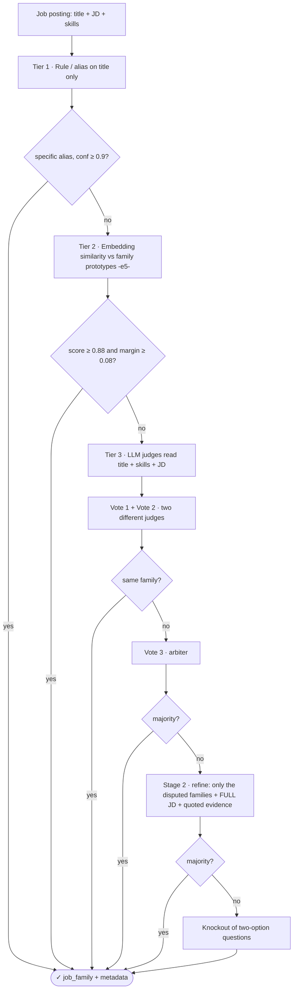
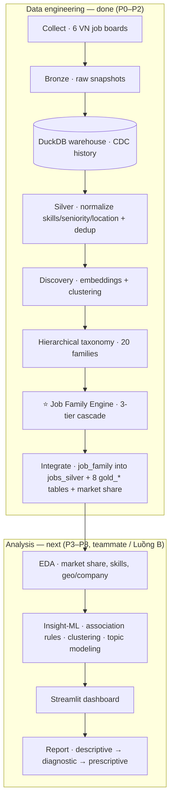

# Vietnam Data Job Market Analysis

> A **Data-Analyst** project that crawls Vietnamese **Data / IT job postings**, gives every posting a
> reliable **job family** label, and mines the market for **insight**: which roles hire most, which
> skills are in demand, how cities and company types differ, and what a job seeker should learn.

**Current status (authoritative):** [`PROJECT_STATUS.md`](PROJECT_STATUS.md) · **original design (frozen):** [`MASTER_PLAN.md`](MASTER_PLAN.md) · **who-does-what:** [`WORK_DIVISION.md`](WORK_DIVISION.md)

---

## 1. The problem

Vietnamese job boards advertise thousands of "data" roles, but the market is **impossible to read
directly** because there is **no standard role label**:

- **Titles are inconsistent and bilingual** — `Data Engineer`, `Kỹ sư dữ liệu`, `Chuyên viên phân tích`,
  `AI/Automation Engineer`, `Senior Sales Performance Analyst`… the same job wears many names.
- **Many data roles never say "data"** in the title (a BI developer titled "Reporting Specialist",
  a risk analyst, an ML engineer titled "AI Engineer").
- **Generic titles are ambiguous** — `Specialist`, `Executive`, `Consultant`, `Officer` tell you nothing
  on their own.

So before you can answer *any* market question, you must first solve one thing: **what job family does
each posting actually belong to?** That label is the key every downstream analysis depends on.

**Questions this project answers** (once every job is labeled):
1. **Market share** — what % of the data market is each family (Data Analyst, BA, Data Engineer, AI…)?
2. **Skills demand** — which skills/tools each family needs, and which combos to learn together.
3. **Comparisons** — how demand differs by city (HN / HCM / ĐN), company type (product / outsourcing / bank), seniority.
4. **Guidance** — concrete "what should I learn for role X" takeaways.

> **Out of scope (by design):** no salary (not in the data), no LinkedIn, no demand forecasting (only one
> snapshot so far). This is **data analytics for insight**, not a prediction/ML product.

---

## 2. The core component — Job Family Labeling Engine ⭐

Because titles alone are not enough, the heart of the project is a **standalone, reusable labeling
engine** (`job_family_engine/`) that reads **title + job description + skills** and assigns a
**hierarchical job family** (`Domain → Sub-domain → Family`, 20 families) with confidence + provenance.

It is a **3-tier cascade** — cheap & precise first, expensive only for the hard remainder:


```mermaid
flowchart TD
    T[Job posting: title + JD + skills] --> R[Tier 1 · Rule / alias on title only]
    R --> RC{specific alias, conf ≥ 0.9?}
    RC -- yes --> DONE([✓ job_family + metadata])
    RC -- no --> E[Tier 2 · Embedding similarity vs family prototypes -e5-]
    E --> EC{score ≥ 0.88 and margin ≥ 0.08?}
    EC -- yes --> DONE
    EC -- no --> L[Tier 3 · LLM judges read title + skills + JD]
    L --> V1[Vote 1 + Vote 2 · two different judges]
    V1 --> AG{same family?}
    AG -- yes --> DONE
    AG -- no --> V3[Vote 3 · arbiter]
    V3 --> MAJ{majority?}
    MAJ -- yes --> DONE
    MAJ -- no --> RF[Stage 2 · refine: only the disputed families + FULL JD + quoted evidence]
    RF --> RM{majority?}
    RM -- yes --> DONE
    RM -- no --> KO[Knockout of two-option questions]
    KO --> DONE
```

- **Tier 1 — Rules** (YAML config, **title only, never reads the JD**): matches only *specific* aliases,
  accept at conf ≥ 0.9. Resolves **489 jobs**. Aliases are deliberately narrow — broad ones like
  `rủi ro` / `phân tích tài chính` / `nghiên cứu` were removed in 2026-07 after they pulled generic
  banking, FP&A and market-research roles into data families at high confidence.
- **Tier 2 — Embedding similarity**: multilingual-`e5` cosine vs family prototypes, accepted only on a
  real gap to the runner-up (`≥ 0.88` / margin `≥ 0.08`). **At these thresholds it currently accepts
  nothing** — an honest result: at the old margin of `0.02` the "winner" was float noise, and an audit of
  the 58 jobs it had accepted found labels like *UI-UX Designer → AI_ENGINEER* and *Software Engineer →
  BIG_DATA_ENGINEER*. Ambiguous jobs now fall through to a tier that actually reads the JD.
- **Tier 3 — LLM consensus with failover**: every remaining job (**1,212**) is judged by **≥ 2 different
  judges**; if they disagree a **third arbitrates** by majority, and anything still split goes to the
  stage-2 `refine` pass described in §4. Judges are free-tier and modular (Groq Llama-3.3-70B, OpenRouter Qwen-2.5-72B, Gemini
  2.0 Flash, Cerebras gpt-oss-120B, GitHub gpt-4o-mini, Mistral Large). A judge that exhausts its daily
  quota is marked dead for the whole run and skipped; every answer is **disk-cached**, so reruns are
  cheap and resumable.

> **Why a uniform 2-vote bar:** an earlier version accepted a single vote whenever the label was a
> confident non-`{OTHER, BUSINESS_ANALYST}` family. That held BA/OTHER to a stricter evidence bar than
> the data families and so quietly pushed borderline postings *into* data families. Self-reported LLM
> confidence cannot substitute for a second opinion either — among jobs where two judges disagreed,
> **36/66 had both judges claiming confidence ≥ 0.85**.

Output per job: `domain, subdomain, job_family, confidence_score, labeling_method, llm_votes, reasoning,
review_status, taxonomy_version`. API: `engine.predict(job)`.

---

## 3. End-to-end pipeline


```mermaid
flowchart TD
    subgraph DE["Data engineering — done (P0–P2)"]
        C[Collect · 6 VN job boards] --> B[Bronze · raw snapshots]
        B --> W[(DuckDB warehouse · CDC history)]
        W --> S[Silver · normalize skills/seniority/location + dedup]
        S --> D[Discovery · embeddings + clustering]
        D --> TX[Hierarchical taxonomy · 20 families]
        TX --> JE[⭐ Job Family Engine · 3-tier cascade]
        JE --> IG[Integrate · job_family into jobs_silver + 8 gold_* tables + market share]
    end
    subgraph AN["Analysis — next (P3–P8, teammate / Luồng B)"]
        IG --> EDA[EDA · market share, skills, geo/company]
        EDA --> ML[Insight-ML · association rules · clustering · topic modeling]
        ML --> DASH[Streamlit dashboard]
        DASH --> REP[Report · descriptive → diagnostic → prescriptive]
    end
```

Everything in **Data engineering (P0–P2)** is done and shipped in `data/warehouse.duckdb`. Everything in
**Analysis (P3–P8)** is the remaining work for the analysis teammate — see [`WORK_DIVISION.md`](WORK_DIVISION.md).

---

## 4. Results (P2)

**1,701 postings labeled, 100% resolved, 0 manual review.** Every LLM-tier label carries **≥2 agreeing
judges** (1,209 jobs); inter-judge agreement **86.8%** (measured over all 1,212 LLM-decided rows — an
earlier figure of 87.6% excluded the 30 hardest, disputed rows and was therefore biased upward).

> ⚠️ **86.8% is conditioned on whichever judge pair happened to run**, so it flatters the engine. A
> fixed-pair measurement on the shared vote cache gives **82.7%** (cerebras vs mistral, n=820) and a
> pairwise range of **44.8%–92.5%** across all pairs; the rate at which each judge calls a posting "not a
> data role" is 75.4% / 70.0% / 60.1% on the same 293 postings, which means **base membership itself is
> judge-dependent**. See §"What the quality evidence actually is" below before quoting any single number.
> Note also that **59% of the 720-posting analysis base was decided by the title rule, not by an LLM.**

The 30 postings the open-ended vote could not settle were resolved by a **second stage**
(`python -m pipeline refine`) rather than by adding more of the same votes. Titles like `Analyst`,
`AI Solutions Architect` or `Platform Engineer` drew a different-but-defensible family from every judge,
because a 20-way question invites a 20th answer. Stage 2 changes the question instead: the choice set is
narrowed to exactly the disputed families, the judge reads the **full** JD (not the 2,500-char window),
and it must quote the decisive sentence. 27 settled that way; the last 3 went to a **knockout of
two-option questions** — three judges on a binary choice always yield a majority, and binary is the
best-grounded question form. Provenance stays visible in `labeling_method` (`refine:…`,
`refine-knockout:…`) so any reader can see which labels needed the extra stage.

### Lead with the domain roll-up — it is the defensible ranking

The taxonomy is hierarchical (`Domain → Sub-domain → Family`), so aggregates roll up for free —
table `gold_domain_share`, over the **720** active Data/AI postings:

| Domain | n | Share |
|---|--:|--:|
| Analytics (DA · BA · BI · Product · Risk) | 338 | **46.9%** |
| AI / Machine Learning (AI · ML · DS · CV-NLP · GenAI) | 179 | **24.9%** |
| Data Engineering (DE · Analytics Eng · DataOps · DBA) | 145 | **20.1%** |
| Governance & Architecture | 40 | 5.6% |
| Data Leadership | 18 | 2.5% |

These gaps (20+ pt) are far larger than the uncertainty, so `Analytics > AI/ML > Data Engineering` holds.
Rolling up also dissolves 26% of the engine's own labeling disagreements — every `AI vs ML vs GenAI`,
`BI vs BA vs Risk` and `BigData vs DE` tie is intra-domain noise.

**Family detail** (same 720 postings) — useful for skills work, but see the caveats below:

| Family | Share | | Family | Share |
|---|--:|--|---|--:|
| Business Analyst | 19.9% | | BI Analyst/Dev | 5.9% |
| Data Engineer | 17.2% | | Data Scientist | 4.4% |
| AI Engineer | 15.2% | | Data Governance | 3.9% |
| Data Analyst | 14.9% | | Data Leadership | 2.4% |
| Risk/Fraud Analyst | 6.0% | | CV / NLP | 1.7% |

…and 10 smaller families (Data Architect, GenAI/LLM, ML Engineer, DBA, Product Analyst, Analytics
Engineer, Big Data Engineer, DataOps, MLOps, Research Scientist). Full breakdown: [`docs/labeling_kpi.md`](docs/labeling_kpi.md),
taxonomy: [`docs/TAXONOMY.md`](docs/TAXONOMY.md).

### How much to trust these numbers

Read the top four **families** as one cluster at 15–20%, **not a ranking** — the domain roll-up above is
where a ranking is safe:

- With n ≈ 720, the sampling error on a ~15% share is already **±1.3 pt**.
- Labels are **judge-dependent, and this was observed, not theorised**: swapping which judges vote (same
  corpus, same prompt) moved Data Engineer from 158 jobs to 119 and handed the #1 family spot to Business
  Analyst. Judges differ systematically in how readily they answer `OTHER` (61% for Llama-3.1-8B vs 77%
  for gpt-oss-120B), so the family order at the top is not a stable finding. Domain shares barely move.
- Rewording the tier-3 prompt (v2 → v3) moved **~13% of all labels**. Wording is a real source of
  variance, not a rounding detail.
- Every family is scoped by the **scrape keywords**: ~48% of the crawled corpus is not a data role at
  all, so "X% of the data market" is a statement about this corpus, not about Vietnam as a whole.

**Derived fields carry their provenance.** `seniority` and `company_type` are filled by deterministic
rules first and only then by an LLM where the rules gave up, and `seniority_source` /
`company_type_source` record which decided each value (`rule` / `llm` / `manual` / `none`). Current
coverage on the 720-posting base: seniority `rule_title` 342 · `rule_years_source` 183 ·
`rule_years_jd` 161 · `llm` 29 · unresolved **5 (0.7%)**; employer industry `rule` 464 · `llm` 152 ·
unresolved **104 (14.4%)**. The three `rule_*` values stay apart on purpose — collapsing them hid that
22% of all seniority came from a regex over JD prose rather than from a title, and a blind audit
(`analysis/audit_seniority.py`) then measured each tier separately and found the weakest one was *not* the
one the design expected. The industry LLM path requires **two judges
to agree on the brand** and answers `unknown` otherwise, so the residual is an honest long tail of 84
small employers (88 postings) rather than a guess.

**Human review: not done yet — do not cite it.** `data/labeling/spot_check.csv` holds a tier-stratified
30-job sample with each label's recorded `reasoning`, and its `verdict` column is **empty, 0 of 30**
(re-checked 2026-07-28). An earlier version of this section claimed the author had read all 30 and marked
every reasoning plausible; the author reports doing so on another machine but the result was never saved,
so **there is no auditable artifact** and no accuracy figure may be quoted from it. Filling
`human_family` for those 30 rows *before* looking at the engine's answer is the cheapest way to earn one.

**What the quality evidence actually is.** Two numbers, and they measure different things:

* `docs/labeling_kpi.md` reports **base-LLM agreement 86.8%** — for each LLM-decided posting, did the
  judges that happened to run on it agree? It is conditioned on whichever pair was alive at that moment.
* A **fixed-pair** measurement on the shared vote cache is less flattering and more honest: cerebras and
  mistral agree on **82.7%** of the 820 postings both judged, and pairwise agreement across all judge
  pairs ranges **44.8%–92.5%**. On 293 postings judged by all three main judges, the rate at which each
  calls a posting "not a data role" is 75.4% / 70.0% / 60.1% — so **base membership is judge-dependent**.
  Quote this range, not the single 86.8%.

`jf_confidence` mixes a rule constant (0.90 for all 426 rule-tier rows in the base), a cosine score and
self-reported LLM numbers — it is provenance, never an accuracy estimate.

---

## 5. Sources (per snapshot, ~1,700 distinct postings, full JD)

| Source | ~Count | Access |
|---|--:|---|
| VietnamWorks | 790 | public JSON API |
| CareerViet | 382 | server-rendered HTML |
| ITviec | 286 | HTML via ScraperAPI |
| TopCV | 99 | Cloudflare → Claude-in-Chrome |
| TopDev | 82 | JSON API (robots-override, personal use) |
| Glints | 62 | GraphQL |

Responsible scraping: robots.txt, randomized 3–8s delays, UA rotation, raw cache, credit guard.

---

## 6. Repo layout

```
pipeline/            ingest/ · transform/ (load·silver·gold) · dataset/ (discovery + LLM clients) · utils/ · __main__.py (CLI)
job_family_engine/   taxonomy/taxonomy_v1.yml · rules.py · embed_match.py · llm_judge.py ·
                     engine.py (dynamic-failover cascade) · evaluate.py (KPIs) · integrate.py (→ silver + Gold)
ref/                 reference dictionaries (skills, seniority, company type) + taxonomy/
docs/                DATA_DICTIONARY · TAXONOMY · DATA_LINEAGE · labeling_kpi (generated) ·
                     INSIGHTS_BRAINSTORM (report material) · *_FINDINGS (generated by analysis/)
analysis/            market_insights.py (5 figures) · association_rules · skill_clustering ·
                     topic_modeling · validate_gold · figures/ · outputs/
tests/               pytest (112 tests)
data/                warehouse.duckdb IS shipped (the data layer); raw/bronze/labeling/dataset gitignored
```

---

## 7. Quick start

```bash
python -m pip install -e ".[dataset]"      # deps (incl. embeddings + LLM clients)
cp .env.example .env                        # ScraperAPI + LLM keys — only needed to (re)build the data

# Rebuild the data layer from scratch (needs keys + time), OR just use the shipped warehouse (§8):
python -m pipeline scrape                   # crawl → bronze
python -m pipeline enrich --source <src>    # fill JD where listing-only
python -m pipeline load                     # bronze → warehouse (incremental CDC)
python -m pipeline silver                   # normalize + dedup → jobs_silver
python -m pipeline discover                 # embeddings + clusters (feeds Tier-2)
python -m pipeline label                    # ⭐ Job Family Engine → job_family.parquet (resumable)
python -m pipeline refine                   # stage 2: settle disputed labels (narrowed choice + full JD)
python -m pipeline enrich-llm               # fill seniority + employer industry where rules gave up
python -m pipeline apply-manual             # (optional) apply hand-labelled employers from the todo CSV
python -m pipeline label-kpi                # labeling KPIs + spot-check sample
python -m pipeline integrate                # job_family → jobs_silver + 8 gold_* tables + market share
python -m pipeline gold                     # legacy skill tables, also keyed on job_family (needs integrate first)
python -m pytest -q                         # 112 tests
```

## 8. For the analysis teammate (Luồng B — P3+)

The repo **ships `data/warehouse.duckdb`** (13 MB) — already containing the labeled **`jobs_silver`**
(`job_family`, `jf_domain`, `jf_subdomain`, `jf_confidence`) and all **7 `gold_*`** tables — so you can
start analysing right after cloning, **no rebuild needed**:

```python
import duckdb
con = duckdb.connect("data/warehouse.duckdb", read_only=True)
con.sql("SELECT job_family, n, pct FROM gold_market_share ORDER BY n DESC").show()
con.sql("""SELECT * FROM jobs_silver
            WHERE job_family NOT IN ('OTHER') AND is_active AND is_duplicate_of IS NULL
              AND COALESCE(jf_review,'resolved') NOT IN ('manual_review','domain_only')
            LIMIT 5""").show()   -- same 720-row base as gold_*
```

Your work keys off `jobs_silver.job_family` + the `gold_*` tables — you do **not** need the engine
internals. Read [`WORK_DIVISION.md`](WORK_DIVISION.md) for the split and
[`docs/DATA_DICTIONARY.md`](docs/DATA_DICTIONARY.md) for every column.
*(Note: the warehouse also holds raw scraped JD in the `jobs` table — keep repo access controlled.)*

---

## 9. Design decisions (why it's built this way)

- **Label first, analyse second.** No standard role label exists, so labeling is the gate for every
  insight — hence a dedicated, reusable engine rather than ad-hoc title rules (the old rule label was
  ~27% contaminated).
- **3-tier cascade for cost.** The title-only rule tier (free, local) resolves ~29% of jobs; the LLM is
  spent on the genuinely ambiguous remainder. **Cheap tiers must be narrow, not just cheap** — a
  short-circuiting tier that guesses is worse than no tier, because the LLM never gets to read the JD.
- **Uniform ≥2-judge consensus, with failover for throughput.** Every LLM-tier label needs two
  independent judges to agree (third arbitrates), because a *selective* bar applied only to
  contamination-prone labels biases borderline jobs toward whatever is checked less. Free-tier limits are
  survivable because the disk cache is checked *before* any rate throttle and exhausted providers are
  skipped for the rest of the run.
- **Report uncertainty, not a leaderboard.** Labels shift with judge choice and prompt wording, so the
  deliverable states share *ranges* and refuses to defend a "#1 family".
- **Hierarchical taxonomy** lets sparse families (MLOps, DataOps…) roll up to a sub-domain/domain for
  statistically meaningful aggregates.
- **Constraints:** no salary · no LinkedIn · no forecasting (1 snapshot) · VN + Data only · secrets only
  via `.env`. A Data-Analytics project, **not** an ML/MLOps product.
