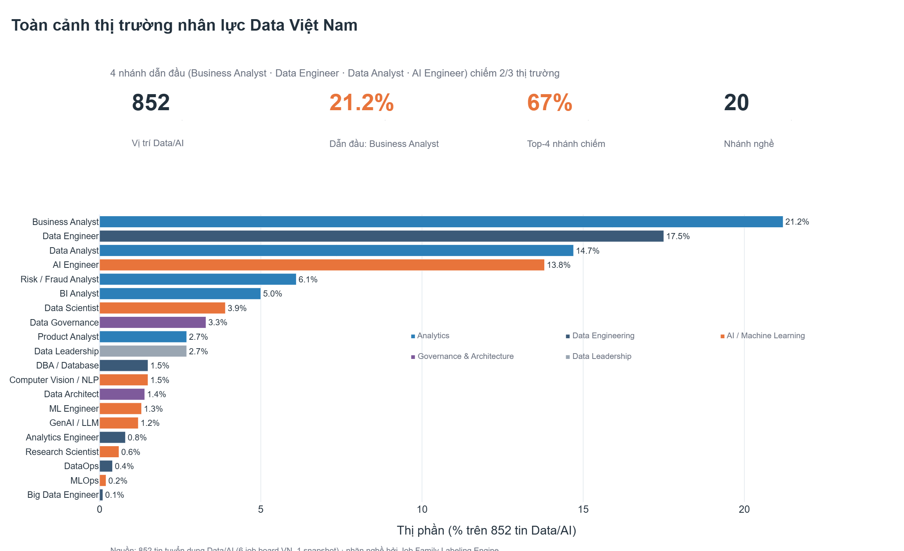
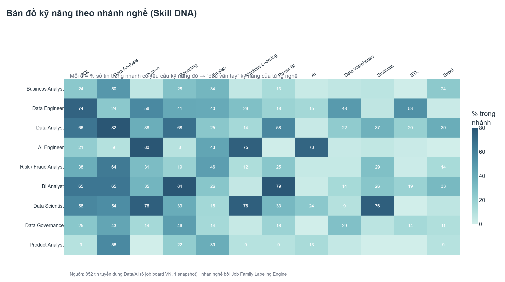
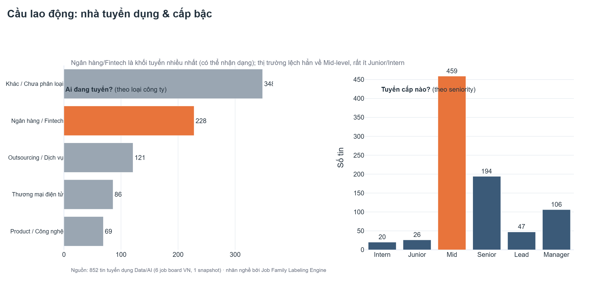

# Thị trường nhân lực Data Việt Nam — Báo cáo Insight

*Báo cáo phân tích mẫu (Phase 4) trên tập dữ liệu tuyển dụng đã gán nhãn. Snapshot: 06/2026.*
*Phạm vi: **852** tin Data/AI đang hoạt động, đã khử trùng lặp (tập non-OTHER), rút từ **1.701** tin
đã gán nhãn trên 6 job board Việt Nam. Mỗi tin mang nhãn `job_family` do Job Family Labeling Engine
gán (đã spot-check tay — đúng trên mọi nhánh).*

> Biểu đồ tạo bằng **Plotly** từ warehouse — tái lập: `python analysis/market_insights.py`
> (ảnh PNG trong `analysis/figures/`, bản tương tác `.html` cùng thư mục).

---

## Tóm tắt điều hành (Executive summary)

> **Thị trường Data Việt Nam là thị trường *phân tích & giao tiếp nghiệp vụ*, không phải thị trường
> *nghiên cứu mô hình*.** Một nửa nhu cầu là người biến dữ liệu thành quyết định (domain Analytics ≈ 50%);
> các vai trò mô hình hoá thuần (Data Scientist 3,9%, ML/MLOps/Research cộng lại < 3%) chỉ là lát mỏng.

1. **Business Analyst là nhánh lớn nhất (21,2%)**, kế đến Data Engineer (17,5%), Data Analyst (14,7%),
   AI Engineer (13,8%). **Bốn nhánh này chiếm 2/3 thị trường.**
2. **Một lõi 3 kỹ năng chạy xuyên suốt: SQL (44%), Data Analysis (43%), Python (39%)** — cộng thêm
   Reporting (36%) và đáng chú ý là **Tiếng Anh (34%)**.
3. **Các nghề tách biệt rõ theo kỹ năng** — chứng tỏ việc gán nhãn có ý nghĩa; mỗi nhánh có "dấu vân tay"
   kỹ năng riêng (DA = Power BI/Reporting, DE = ETL/Warehouse, AI = ML/**LLM 69%**).
4. **Ngân hàng & Fintech là khối tuyển lớn nhất có thể nhận dạng (≥27%)** và gần như *độc chiếm* mảng
   phân tích rủi ro/gian lận (**75%** số tin Risk/Fraud).
5. **Thị trường cần kinh nghiệm: 54% là Mid-level, chỉ ~5% Junior/Intern** — cửa vào nghề là phần khó nhất.

---

## 1. Cấu trúc thị trường — Analytics dẫn dắt, mô hình hoá là ngách



Thị trường chia thành 5 domain: **Analytics 50% (424 tin)**, AI/ML 23% (192), Data Engineering 20% (173),
Governance & Architecture 5% (40), Leadership 3% (23).

- **Phát hiện.** 4 nhánh dẫn đầu (BA 181 · DE 149 · DA 125 · AIE 118) chiếm **67%** toàn thị trường;
  16 nhánh còn lại chia nhau 1/3 — nhiều nhánh rất mỏng (MLOps 2 tin, Big Data Engineer 1 tin).
- **Ý nghĩa.** Cầu tập trung vào nhóm *dùng* dữ liệu để phục vụ nghiệp vụ (BA, DA, BI, Risk) hơn hẳn
  nhóm *xây mô hình* (DS/ML/Research cộng lại < 9%). "AI Engineer" (14%) là thật và đang lên, nhưng đó là
  **kỹ thuật-ứng-dụng-AI** (LLM/ML ứng dụng), không phải nghiên cứu khoa học.
- **Hàm ý.** Với phần lớn người mới, cửa vào xác suất cao nhất là **Analytics/BA/BI**, không phải Data
  Science. Doanh nghiệp tuyển dữ liệu nên ưu tiên năng lực phân tích-nghiệp vụ trước năng lực mô hình.

---

## 2. Bản đồ kỹ năng theo nghề (Skill DNA)



- **Phát hiện.** Một **lõi chung** phủ mọi nghề: SQL 44%, Data Analysis 43%, Python 39%, Reporting 36%.
  **Tiếng Anh 34%** xuất hiện như một "kỹ năng" thực thụ — rào cản ngôn ngữ là có thật.
- **Mỗi nghề có dấu vân tay riêng** (đọc theo hàng trong heatmap):
  - **Data Analyst** = Data Analysis 82% · Reporting 68% · SQL 66% · **Power BI 58%** (thiên BI/báo cáo).
  - **AI Engineer** = Python 80% · Machine Learning 75% · AI 73% · **LLM 69%** (ứng dụng GenAI rõ rệt).
  - **Data Engineer** = SQL · Python · **ETL · Data Warehouse** (thiên hạ tầng/pipeline).
- **Ý nghĩa.** Các cụm kỹ năng tách bạch → nhãn nghề phản ánh khác biệt thật, không phải gán ngẫu nhiên.
- **Hàm ý.** Lộ trình học khác nhau theo đích đến: muốn vào DA → SQL + Power BI + Reporting; muốn vào
  AI Engineer → Python + ML + **LLM/GenAI**; muốn vào DE → SQL + Python + ETL + Data Warehouse.

---

## 3. Cầu lao động — ai tuyển & tuyển cấp nào



- **Ngân hàng/Fintech là khối tuyển lớn nhất nhận dạng được (228 tin, ~27%)** — và *thống trị* mảng
  Risk/Fraud Analyst (**75%** số tin nhánh này đến từ ngân hàng/fintech). (Nhóm "Khác/Chưa phân loại"
  348 tin là phần chưa map được loại hình, không kết luận theo nó.)
- **Thị trường lệch hẳn về Mid-level: 54% (459 tin)**, Senior 23% (194), Manager 12% (106); trong khi
  **Junior + Intern chỉ ~5%** (46 tin).
- **Ý nghĩa.** Doanh nghiệp muốn người *làm được ngay*; rất ít vị trí đào tạo từ đầu → cửa vào nghề hẹp.
- **Hàm ý.**
  - *Người tìm việc mới:* nhắm Analytics/BA/BI (cầu lớn + lõi SQL/Excel/Power BI dễ tiếp cận), tích luỹ
    đủ kỹ năng để ứng tuyển thẳng Mid thay vì chờ vị trí Junior hiếm hoi.
  - *Muốn vào ngành tài chính:* đầu tư mảng Risk/Fraud + SQL — đó là nơi ngân hàng tuyển nhiều nhất.
  - *Nhà tuyển dụng:* thiếu hụt nguồn Junior là cơ hội — chương trình đào tạo nội bộ có thể lấp khoảng
    trống mà thị trường đang bỏ ngỏ.

---

## 4. Lộ trình học — những kỹ năng đi cùng nhau

Phân tích đồng-xuất-hiện kỹ năng (skill co-occurrence) cho thấy các cặp nên học chung:

| Cặp kỹ năng | Số tin cùng yêu cầu |
|---|--:|
| Python + SQL | 220 |
| Reporting + SQL | 188 |
| Data Analysis + SQL | 185 |
| Machine Learning + Python | 168 |
| Power BI + SQL | 156 |
| English + Python | 142 |

- **Phát hiện.** **SQL là trục trung tâm** — nó ghép cặp mạnh nhất với gần như mọi kỹ năng khác.
- **Hàm ý (lộ trình gợi ý).** Nền tảng **SQL + Python** trước; rẽ nhánh theo đích: thêm **Power BI +
  Reporting** (hướng DA/BI) hoặc **Machine Learning + LLM** (hướng AI). Tiếng Anh nên học song song.

---

## 5. Khuyến nghị

**Cho người học/tìm việc:**
1. Học **SQL + Python** làm nền (xuất hiện ở mọi nghề, ghép cặp mạnh nhất).
2. Nhắm **Analytics/BA/BI** để vào ngành — cầu lớn nhất, kỹ năng dễ tiếp cận.
3. Tích luỹ đủ để ứng tuyển **Mid** (thị trường rất ít chỗ Junior/Intern).
4. Tiếng Anh là lợi thế cạnh tranh thực sự (1/3 tin yêu cầu).

**Cho nhà tuyển dụng:** nguồn Junior khan hiếm → đào tạo nội bộ là lợi thế; mảng AI Engineer (LLM) đang
lên nhanh, nên đầu tư sớm.

---

## 6. Hạn chế (đọc số liệu cẩn trọng)

- **1 snapshot duy nhất** → đây là *ảnh chụp* thị trường, **không** suy ra xu hướng/tăng trưởng theo
  thời gian (cần nhiều tuần dữ liệu).
- **Không có lương** trong dữ liệu → không phân tích thu nhập.
- **Nhãn nghề bằng cascade rule→embedding→LLM**: spot-check tay (21 mẫu phân tầng) đúng hết, nhưng ca
  biên (AIE↔MLE, BA↔DA) vẫn có thể lệch; con số nên đọc ở mức xu hướng, không tuyệt đối.
- **`other` (loại công ty) chiếm 41%** là phần chưa phân loại được — chỉ kết luận trên các khối đã nhận dạng.
- Một số nhánh quá mỏng (≤ 5 tin) → không đủ vững để kết luận riêng; nên roll-up lên Sub-domain/Domain.

---

## 7. Tái lập

```bash
python analysis/market_insights.py     # đọc data/warehouse.duckdb (read-only) → analysis/figures/*.png|html
```
Dữ liệu nguồn: bảng `gold_market_share`, `gold_family_skill`, `gold_company`, `gold_seniority`,
`gold_skill_cooccurrence` trong `data/warehouse.duckdb` (do `python -m pipeline integrate` tạo).
