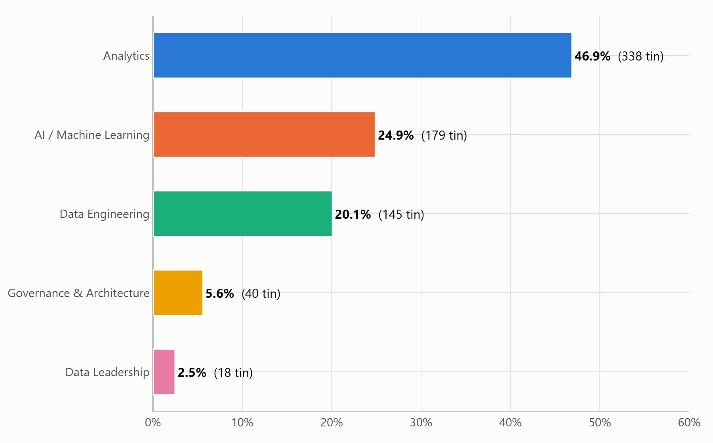
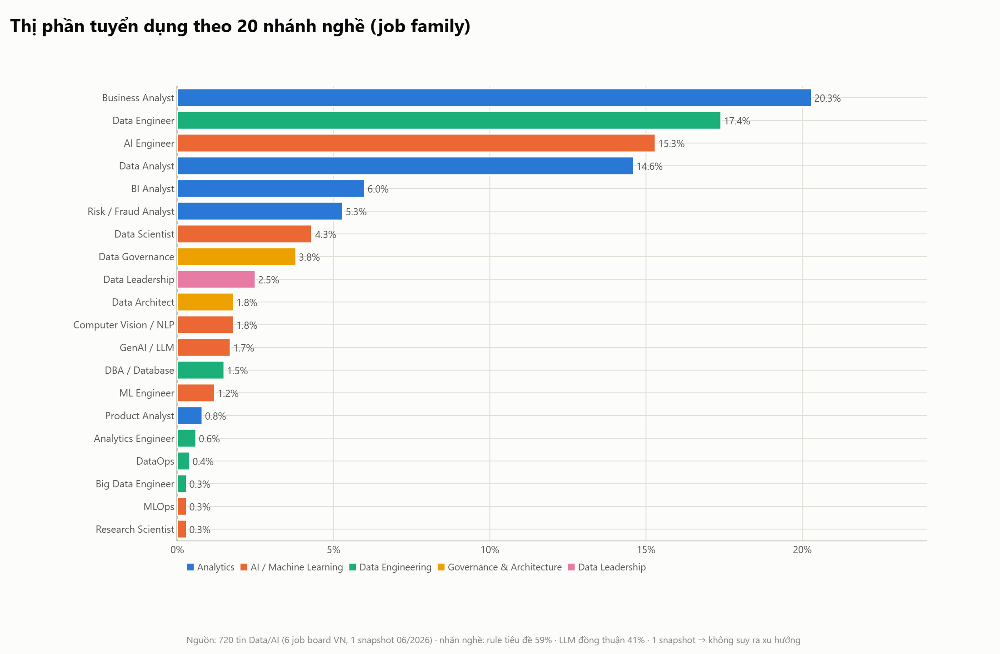
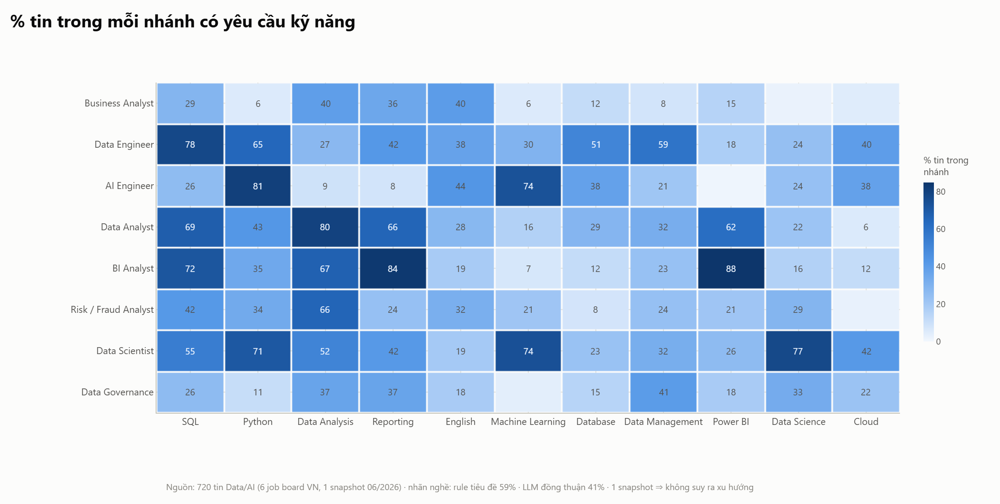
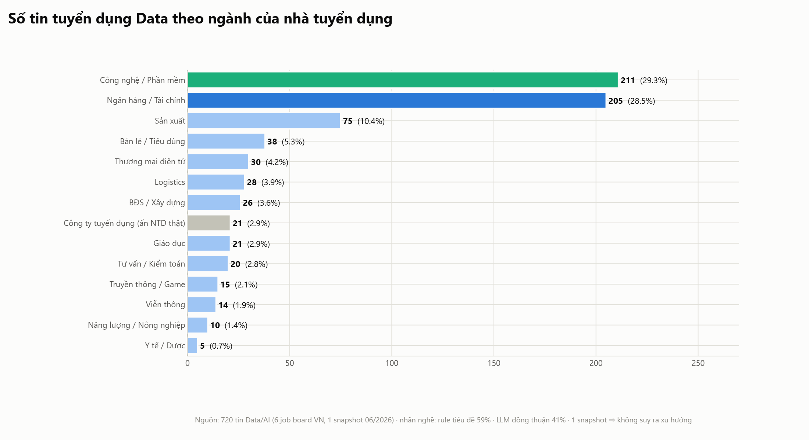
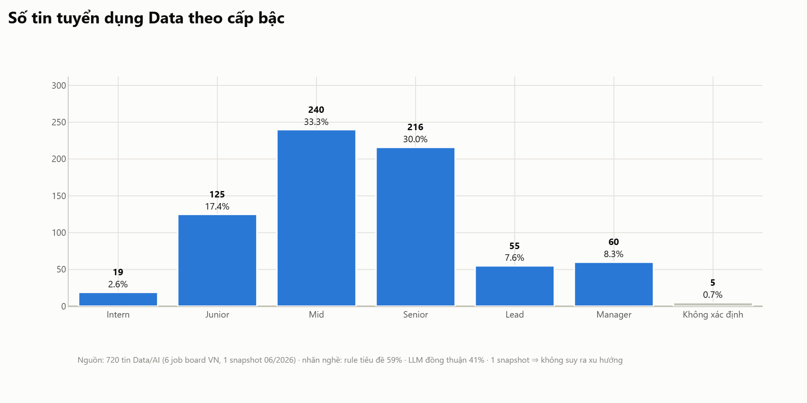

# Thị trường nhân lực Data Việt Nam — Báo cáo Insight

*Báo cáo phân tích (Phase 4) trên tập dữ liệu tuyển dụng đã gán nhãn. Snapshot: **một lát cắt duy nhất
2026-06-16**. Số liệu cập nhật 2026-07-31.*
*Phạm vi: **720** tin Data/AI đang hoạt động, đã khử trùng lặp, non-OTHER, rút từ **1.701** tin trên 6 job
board Việt Nam.*

> ### Bốn giới hạn phải đọc trước mọi con số bên dưới
>
> **1. Nhãn nghề: 59% do regex tiêu đề, 41% do LLM.** Không phải "≥2 LLM judge đồng thuận" như bản trước
> của báo cáo này viết. Tầng `rule` quyết định 426/720 tin, và 317 trong số đó chưa từng có judge nào đọc.
>
> **2. Nhãn phụ thuộc judge nào còn quota.** Đo ghép cặp trên cùng 293 tin (cùng prompt, `temperature=0`):
> tỉ lệ gọi `OTHER` là cerebras 75,4% · mistral 70,0% · groq-8b 60,1%. Đồng thuận từng cặp judge dao động
> 44,8%–92,5%; cặp dùng nhiều nhất là 82,7%. **Đừng đọc thứ hạng cấp family như một phát hiện.**
>
> **3. Cấp domain cũng không bền.** Tỉ lệ Analytics theo từng board: vietnamworks 60,4% · topcv 53,8% ·
> careerviet 50,9% · itviec 28,9% · glints 25,5%. Vì vnw chiếm 255/720, **"Analytics 46,9%" phần lớn là
> profile của VietnamWorks pha loãng**, không phải cấu trúc thị trường Việt Nam.
>
> **4. Đã có nhãn người — độ chính xác 96,7%** (29/30; Wilson 95% CI 83,3%–99,4%; người gán nhãn khi đã
> ẩn đáp án của máy). Tầng LLM đúng 21/21; ca sai duy nhất đến từ tầng quy tắc đọc tiêu đề. n=30 nhỏ nên
> đây là **ước lượng**, và nó không cho phép xếp hạng giữa các nghề. `seniority` cũng đã kiểm định mù:
> 86,2% đúng bậc, 96,9% lệch ≤1 bậc (n=65) — xem `docs/INSIGHTS_BRAINSTORM.md` mục A3b.
>
> **Một lát cắt ⇒ không có phát ngôn xu hướng.** Mọi câu "đang tăng / đang hot / nhu cầu giảm" đều
> không có cơ sở trong dữ liệu này. Không có trường lương ⇒ không phát ngôn về thu nhập.

> Biểu đồ tạo bằng **Plotly** từ warehouse — tái lập: `python analysis/market_insights.py`
> (5 ảnh PNG trong `analysis/figures/`, bản tương tác `.html` cùng thư mục).

---

## Tóm tắt điều hành (Executive summary)

> **Thị trường Data trên 6 job board này là thị trường *phân tích & giao tiếp nghiệp vụ*, không phải thị
> trường *nghiên cứu mô hình*.** Gần một nửa nhu cầu là người biến dữ liệu thành quyết định (domain
> Analytics 46,9%); các vai trò mô hình hoá thuần (Data Scientist 4,3%, ML/MLOps/Research cộng lại < 3%)
> chỉ là lát mỏng. Xem giới hạn 3 ở trên: con số 46,9% phụ thuộc mạnh vào thành phần job board.

1. **Nhánh Analytics lớn nhất (46,9%, 338 tin)**, kế đến AI/ML (24,9%, 179) và Data Engineering
   (20,1%, 145). Ở cấp family: BA 20,3% · DE 17,4% · AIE 15,3% · DA 14,6% — bốn con số **nằm trong sai số
   của nhau** (đổi judge dịch 1–2pt), cộng lại chiếm 2/3 thị trường. Đọc như *một cụm*, không phải xếp hạng.
2. **Một lõi 3 kỹ năng chạy xuyên suốt: SQL (47,8%), Python (43,5%), Data Analysis (39,6%)** — cộng thêm
   Reporting (38,3%) và đáng chú ý là **Tiếng Anh (33,8%)**. Sau khi bổ sung từ điển 2026-07-28, tầng hạ
   tầng lộ ra rõ hơn: **Database 28,1%** · **Data Management 27,9%** · **Data Science 21,0%** ·
   **Cloud 20,8%** — trước đó bốn kỹ năng này không được đếm ở đâu cả.
3. **Mỗi nhánh có "dấu vân tay" kỹ năng riêng** (DA = Power BI/Reporting, DE = ETL/Warehouse,
   AI = ML/**LLM 69,1%**). Nhưng kỹ năng **không tạo thành cụm nghề tự nhiên**: silhouette chỉ 0,132–0,191
   qua k=2..20 ⇒ **không có cụm nghề tự nhiên**. Nguyên nhân chính là một phát hiện thật: các nghề chia sẻ
   lõi kỹ năng chung quá mạnh nên mọi tin đều na ná nhau.
4. **Công nghệ/Phần mềm (29,3%, 211 tin) và Ngân hàng/Tài chính (28,5%, 205) tuyển ngang nhau** — chênh
   0,8pt, không xếp hạng được. Độ phủ ngành nay là **100%** — không còn nhóm "không xác định".
   ⚠️ **Chênh lệch cơ cấu theo ngành phần lớn là hiệu ứng job board** (kiểm 2026-08-03): "công nghệ tuyển
   AI Engineer nhiều gấp 3" có OR thô 2,08 (p = 1e-04) nhưng **OR Cochran–Mantel–Haenszel phân tầng theo
   board chỉ còn 1,29 (p = 0,24)** — trên ITviec hiệu ứng là +0,7pt, trên TopCV **âm** (−10,3pt). Xem §4.
5. **Thị trường cần kinh nghiệm: Mid 33,3% + Senior 30,0% = 63%; Junior 17,4% + Intern 2,6% = 20%.**
   Bản trước của báo cáo này ghi "54% Mid, ~5% Junior/Intern" — con số đó là **hiện vật của cách đo**, không
   phải sự thật thị trường: quy tắc cũ có `default: Mid` hút 45% corpus và không đọc số năm kinh nghiệm.
   🛑 **Chênh lệch cửa vào giữa các nhánh thì KHÔNG dùng làm luận điểm** — xem §3.

---

## 1. Cấu trúc thị trường — Analytics dẫn dắt, mô hình hoá là ngách





Thị trường chia thành 5 domain: **Analytics 46,9% (338 tin)**, AI/ML 24,9% (179), Data Engineering
20,1% (145), Governance & Architecture 5,6% (40), Data Leadership 2,5% (18).

- **Phát hiện.** 4 family dẫn đầu (BA 146 · DE 125 · AIE 110 · DA 105) chiếm **67,8%** toàn thị trường;
  16 family còn lại chia nhau 1/3 — nhiều nhánh rất mỏng (dưới 30 tin thì **không báo cáo tỉ lệ %**).
- **`BUSINESS_ANALYST` là family lớn nhất, và là một rổ HỖN HỢP.** Taxonomy đặt nó trong domain
  Analytics, và quy tắc gán nhãn **cố ý** đưa việc *requirements trên hệ thống IT* vào đây — nên một BA
  viết BRD/SRS mà không đụng SQL **vẫn được gán đúng**. Nhưng bên trong family này có hai kiểu công việc
  khá khác nhau: khoảng **55%** tin có công cụ phân tích, khoảng **21%** chỉ có đặc tả/ERP/UAT.
  Khi trích con số "family lớn nhất", phải nói kèm điều này — người đọc mặc định sẽ hình dung người làm
  phân tích. Các family Analytics khác thì đồng nhất (Data Analyst, BI, Risk/Fraud đều 0% ở nhóm chỉ-đặc-tả).
- **Ý nghĩa.** Cầu tập trung vào nhóm *dùng* dữ liệu để phục vụ nghiệp vụ (BA, DA, BI, Risk) hơn hẳn
  nhóm *xây mô hình* (DS/ML/Research cộng lại < 9%). "AI Engineer" (14%) là thật và đang lên, nhưng đó là
  **kỹ thuật-ứng-dụng-AI** (LLM/ML ứng dụng), không phải nghiên cứu khoa học.
- **Hàm ý.** Với phần lớn người mới, cửa vào xác suất cao nhất là **Analytics/BA/BI**, không phải Data
  Science. Doanh nghiệp tuyển dữ liệu nên ưu tiên năng lực phân tích-nghiệp vụ trước năng lực mô hình.

---

## 2. Bản đồ kỹ năng theo nghề (Skill DNA)



- **Phát hiện.** Một **lõi chung** phủ mọi nghề: SQL 47,8% (344 tin), Python 43,5% (313),
  Data Analysis 39,6% (285), Reporting 38,3% (276). **Tiếng Anh 33,8%** (243) xuất hiện như một "kỹ năng"
  thực thụ — rào cản ngôn ngữ là thật.
- **Tầng hạ tầng lớn hơn tưởng:** sau khi bổ sung từ điển 2026-07-28, `Database` **28,1%** (202 tin) và
  `Data Management` **27,9%** (201) lọt vào top-8, cùng `Data Science` 21,0% và `Cloud` 20,8%. Trước đó
  bốn kỹ năng này **không được đếm ở đâu cả** nên bảng skill cũ đã báo thiếu.
- ⚠️ **Kỹ năng mềm cố ý không nằm trong bảng này.** Nếu thêm, `Communication` sẽ phủ **37,4%** (đứng thứ 5),
  `Analytical Skills` 28,1%. Chúng bị loại vì từ điển quét toàn văn JD nên chỉ bắt câu sáo rỗng
  ("good communication skills") và sẽ ghép cặp vô nghĩa với mọi kỹ năng khác trong phân tích lộ trình học.
  Con số 37,4% vẫn trích dẫn được như một quan sát riêng.
- **Mỗi nghề có dấu vân tay riêng** (đọc theo hàng trong heatmap):
  Dưới đây là skill **đặc trưng** (lift = mức vượt trội so với toàn thị trường), không phải skill phổ biến:
  - **Data Analyst** = **Power BI 62% (x2,5)** · Statistics 43% (x2,4) · Tableau 40% (x2,8) ·
    Data Visualization 33% (x3,0) — thiên trực quan hoá/báo cáo.
  - **AI Engineer** = **LLM 69% (x4,3)** · NLP 35% (x5,1) · Computer Vision 32% (x4,9) ·
    PyTorch 32% (x4,1) — ứng dụng GenAI rõ rệt.
  - **Data Engineer** = Data Pipeline 44% (x3,5) · Spark 42% (x3,8) · **ELT 39% (x4,4)** ·
    Data Lake 33% (x3,6) — thiên hạ tầng.
  - **Business Analyst** = **Business Analysis 62% (x3,6)** · ERP (x2,3) · Agile (x2,2) — và **lift ÂM
    trên công cụ dữ liệu**: SQL x0,60 · Python x0,13. Tức BA có dấu vân tay rất rõ, nhưng là dấu vân tay
    của *một loại công việc khác*.
    *(Bản trước ghi "BA không có dấu vân tay, lift cao nhất x1,2" — con số đó tính khi kỹ năng
    `Business Analysis` chưa có trong từ điển. Sau khi bổ sung từ điển thì phát hiện đảo chiều.)*
- **Ý nghĩa.** Các cụm kỹ năng tách bạch → nhãn nghề phản ánh khác biệt thật, không phải gán ngẫu nhiên.
- **Hàm ý.** Lộ trình học khác nhau theo đích đến: muốn vào DA → SQL + Power BI + Reporting; muốn vào
  AI Engineer → Python + ML + **LLM/GenAI**; muốn vào DE → SQL + Python + ETL + Data Warehouse.

---

## 3. Cầu lao động — ai tuyển & tuyển cấp nào





- **Công nghệ/Phần mềm 211 tin (29,3%) và Ngân hàng/Tài chính 205 tin (28,5%) ngang nhau** — chênh 0,8pt.
  Sản xuất thứ ba (75 tin, 10,4%). Cơ cấu tuyển khác nhau: công nghệ dẫn đầu bằng **AI Engineer 53**, ngân
  hàng bằng **Business Analyst 38** và độc chiếm **Risk/Fraud 29/38 tin** cùng **Data Governance 14/27**.
  ⚠️ Bản trước xếp ngân hàng trên công nghệ (199 vs 176) — kết luận đó **đã bị lật** khi 14,4% tin chưa
  phân loại được ngành cuối cùng lệch mạnh về phía công nghệ.

- 🛑 **Kiểm biến gây nhiễu "job board" cho liên hệ ngành × nhánh (2026-08-03).** Job board liên hệ rất
  mạnh với **cả hai** biến (source × company_type: χ² = 241,0 · p = 1,2e-20), nên nó là confounder kinh
  điển. Cochran–Mantel–Haenszel phân tầng theo board:

  | Liên hệ | OR thô | p thô | **OR_MH** | **p_CMH** | Nhất quán trong board | Phán quyết |
  |---|--:|--:|--:|--:|---|---|
  | tech_software → AI/ML | 2,08 | 1e-04 | **1,29** | **0,243** | ITviec +0,7pt · TopCV **−10,3pt** | 🛑 **BỎ** |
  | tech_software → ít Analytics | 0,56 | 6e-04 | **0,80** | **0,262** | — | 🛑 **BỎ** |
  | manufacturing → Analytics | 2,48 | 4e-04 | 1,85 | 0,028 | **3/3 board cùng hướng** | ⚠️ giữ, nêu kèm cỡ mẫu |
  | manufacturing → ít Data Engineering | 0,32 | 0,004 | 0,38 | 0,041 | 3/3 board cùng hướng | ⚠️ giữ, nêu kèm |
  | bank_finance → Governance | 2,40 | 0,011 | 1,98 | 0,042 | chỉ **2/4** board, do ITviec (+15,3pt) | 🛑 **BỎ** |

  Bảng chéo tổng: sau khi gộp 10 ngành < 30 tin (bảng gốc 15×5 có **57% ô expected < 5** — vi phạm giả
  định χ²), bảng 6×5 cho χ² = 50,9 · dof = 20 · p = 1,66e-04 · **Cramér's V = 0,133** (không phải 0,194).
  Liên hệ **yếu**. Phần dư chuẩn hoá điều chỉnh vượt Bonferroni (|z| > 2,99) chỉ còn 3 ô — và cả 3 đều
  liên quan tới `tech_software`/`manufacturing`, tức là chính các ô vừa bị CMH đánh sập hoặc làm yếu đi.
- **14,4% (104 tin) không xác định được ngành.** Nhóm này giữ nguyên thành một mục riêng, **không** chia
  lại vào các nhóm khác — nên mọi % ngành bên trên đều tính trên mẫu số 720 đầy đủ.
- **Cấp bậc: Mid 33,3% (240) + Senior 30,0% (216) = 63%**; Junior 17,4% (125) + Intern 2,6% (19) = **20%**;
  Lead 7,6% (55), Manager 8,3% (60), không xác định chỉ còn 0,7% (5 tin).
- ⚠️ **Đừng dùng lại con số "54% Mid, ~5% Junior" của bản trước.** Nó là hiện vật đo lường: quy tắc cũ có
  `default: Mid` hút 45% corpus và chưa đọc số năm kinh nghiệm. Junior+Intern đã đi 5,6% → 11,7% → 21,9%
  → **20,0%** qua bốn lần sửa *cách đo*, trong khi dữ liệu không đổi một dòng.
- **Kiểm định mù cho cấp bậc:** 86,2% đúng bậc, 96,9% lệch ≤1 bậc (n=65, hai auditor độc lập chỉ thấy
  title+JD). Tầng yếu nhất là trường "số năm kinh nghiệm" do site tự khai (72,7%) — nó là **sàn**, không
  phải yêu cầu thật.
- 🛑 **Chênh lệch cửa vào giữa các nhánh — KHÔNG dùng làm luận điểm. Câu phát biểu chuẩn:**

  > Tỉ lệ Junior+Intern quan sát được dao động 14,5% (Data Engineering) – 26,3% (AI/ML), nhưng kiểm định
  > χ² không đạt ý nghĩa thống kê (χ²(3) = 7,61; p = 0,055). Tỉ lệ này còn khác nhau theo **job board**
  > mạnh hơn theo nhánh nghề (p = 1,5e-07), và bản thân đại lượng đã dịch 5,6% → 20,0% qua bốn lần đổi
  > cách đo. **Không dùng làm luận điểm.**

  Chi tiết ba lớp bằng chứng: `docs/INSIGHTS_BRAINSTORM.md` mục A3.

- **Ý nghĩa (phần còn đứng vững).** Cơ cấu cấp bậc của **toàn tập** nghiêng hẳn về người có kinh nghiệm:
  Mid+Senior 63% so với Junior+Intern 20%. Đây là phát biểu ở mức tổng, không so sánh giữa các nhánh.
- **Hàm ý.**
  - *Người tìm việc mới:* số chỗ Junior/Intern ít hơn Mid/Senior khoảng 3 lần trên toàn tập. **Không có
    bằng chứng** cho việc nhánh nào dễ vào hơn nhánh nào.
  - *Nhà tuyển dụng:* Junior chỉ 17,4% trong khi Mid+Senior 63% — chương trình đào tạo nội bộ có thể lấp
    khoảng trống mà thị trường đang bỏ ngỏ.

---

## 4. Lộ trình học — những kỹ năng đi cùng nhau

Phân tích đồng-xuất-hiện kỹ năng (skill co-occurrence) cho thấy các cặp nên học chung:

| Cặp kỹ năng | Số tin cùng yêu cầu |
|---|--:|
| Python + SQL | 204 |
| Reporting + SQL | 175 |
| Data Analysis + SQL | 168 |
| Data Analysis + Reporting | 159 |
| Machine Learning + Python | 158 |
| Power BI + SQL | 139 |
| Power BI + Reporting | 131 |

- **Phát hiện.** **SQL là trục trung tâm** — nó ghép cặp mạnh nhất với gần như mọi kỹ năng khác.
- **Bundle chuyên sâu** (lift rất cao, vẫn qua kiểm định Bonferroni): TensorFlow↔PyTorch (57 tin, x10,8) ·
  Big Data+Spark→Hadoop (32 tin, x10,5) · Kubernetes+Python→Docker (36 tin, x7,5) · Hadoop→Spark
  (37 tin, x7,3). Đây là các "combo đi liền" — học lẻ một nửa gần như vô nghĩa trên thị trường.
- **1244/1649 luật** vượt hiệu chỉnh Bonferroni ở alpha = 0,05/**4060 giả thuyết đã test**; chỉ trích dẫn
  nhóm này (cột `significant_bonferroni`, KHÔNG dùng `significant_at_kept_alpha`). Lưu ý hai điều:
  (a) mỗi cặp 1-1 được tính **cả hai chiều** (`Python→SQL` và `SQL→Python` là 2 dòng) nên số dòng không
  phải số phát hiện;
  (b) `support_pct` chia cho **663** tin có ≥2 kỹ năng, không phải 720 — cao hơn share thật của toàn base
  khoảng 1,09 lần.
- **Hàm ý (lộ trình gợi ý).** Nền tảng **SQL + Python** trước; rẽ nhánh theo đích: thêm **Power BI +
  Reporting** (hướng DA/BI) hoặc **Machine Learning + LLM** (hướng AI). Tiếng Anh nên học song song.

---

## 5. Khuyến nghị

**Cho người học/tìm việc:**
1. Học **SQL + Python** làm nền (xuất hiện ở mọi nghề, ghép cặp mạnh nhất).
2. Nhắm **Analytics/BA/BI** để vào ngành — cầu lớn nhất, kỹ năng dễ tiếp cận.
3. Tích luỹ đủ để ứng tuyển **Mid** (thị trường rất ít chỗ Junior/Intern).
4. Tiếng Anh là lợi thế cạnh tranh thực sự (1/3 tin yêu cầu).

**Cho nhà tuyển dụng:** nguồn Junior khan hiếm → đào tạo nội bộ là lợi thế; mảng AI Engineer (LLM) đang
lên nhanh, nên đầu tư sớm.

---

## 6. Hạn chế (đọc số liệu cẩn trọng)

- **1 snapshot duy nhất** → đây là *ảnh chụp* thị trường, **không** suy ra xu hướng/tăng trưởng theo
  thời gian (cần nhiều tuần dữ liệu).
- **Không có lương** trong dữ liệu → không phân tích thu nhập.
- **Nhãn nghề bằng cascade rule→embedding→LLM, CHƯA có nhãn người để đối chiếu.** Bằng chứng chất lượng
  là độ đồng thuận giữa các LLM độc lập (≥2 judge phải trùng nhãn), **không phải** accuracy. Ca biên
  (AIE↔MLE, BA↔DA, và ranh giới data↔nghiệp vụ) vẫn lệch được.
- **Nhãn phụ thuộc vào judge và câu prompt**: cùng một tin, các judge khác nhau về mức độ sẵn sàng gán
  `OTHER` (61% so với 77%) → top-4 dịch 1–2pt và có thể đổi thứ tự; sửa câu prompt (v2→v3) làm đổi ~13%
  toàn bộ nhãn. Vì vậy đọc top-4 như **một cụm**, không xếp hạng #1.
- **Tầng rule chỉ đọc tiêu đề, không đọc JD** → alias rộng từng kéo nhầm role nghiệp vụ vào nhánh data
  (đã siết 07/2026, nhưng đây là hạn chế cấu trúc của tầng này).
- **Loại công ty: độ phủ 100%**, không còn `unknown` — 105 tin được người phân loại tay ngày 2026-07-31.
- Một số nhánh quá mỏng (< 30 tin) → **không báo cáo tỉ lệ % riêng**; roll-up lên Sub-domain/Domain.

### 6.1. Giới hạn quan trọng nhất: mẫu không đại diện cho thị trường Việt Nam

Sáu job board có **profile rất khác nhau**, và tỉ lệ tin lọt vào tập phân tích cũng khác nhau — cả hai đều
là hàm của **độ rộng truy vấn khi scrape từng board**, không phải của thị trường:

| Nguồn | Tin scrape | Vào base | % vào base | Analytics | AI/ML | Data Eng |
|---|--:|--:|--:|--:|--:|--:|
| vietnamworks | 790 | 255 | 32,3% | **60,4%** | 13,7% | 13,3% |
| itviec | 286 | 190 | 66,4% | 28,9% | **46,3%** | 18,4% |
| careerviet | 382 | 110 | 28,8% | 50,9% | 16,4% | 24,5% |
| topcv | 99 | 91 | **91,9%** | 53,8% | 9,9% | **36,3%** |
| glints | 62 | 51 | 82,3% | 25,5% | **52,9%** | 19,6% |
| topdev | 82 | 23 | 28,0% | 47,8% | 8,7% | 26,1% |

Tỉ lệ Analytics dao động **25,5%–60,4%** giữa các board. Vì VietnamWorks đóng góp 255/720 tin base,
**"Analytics 46,9%" chủ yếu phản ánh VietnamWorks**. Cấp bậc cũng vậy: glints có Intern+Junior 52,9%
trong khi careerviet 11,8%; Manager ở vietnamworks 16,9% nhưng topcv chỉ 1,1%.

⇒ Mọi con số trong báo cáo này là **"cấu trúc của tập 720 tin đã scrape"**, không phải **"cấu trúc thị
trường Data Việt Nam"**. Đây là giới hạn không sửa được bằng phân tích — chỉ sửa được bằng cách thiết kế
truy vấn scrape đồng nhất giữa các board.

**Điều đã được kiểm và KHÔNG phải vấn đề:** tập trung nhà tuyển dụng (top-10 chỉ 13,6% base, 473 employer,
1,52 tin/employer; thị phần tính ở đơn vị công ty lệch ≤1,2pt so với đơn vị tin) · lỗi encoding tiếng Việt
(0 ca) · near-duplicate còn sót (3 cặp) · chuẩn hoá tên thành phố (11 giá trị, không biến thể trùng).

---

## 7. Tái lập

```bash
python analysis/market_insights.py     # đọc data/warehouse.duckdb (read-only) → analysis/figures/*.png|html
```
Dữ liệu nguồn: bảng `gold_market_share`, `gold_family_skill`, `gold_company`, `gold_seniority`,
`gold_skill_cooccurrence` trong `data/warehouse.duckdb` (do `python -m pipeline integrate` tạo).
