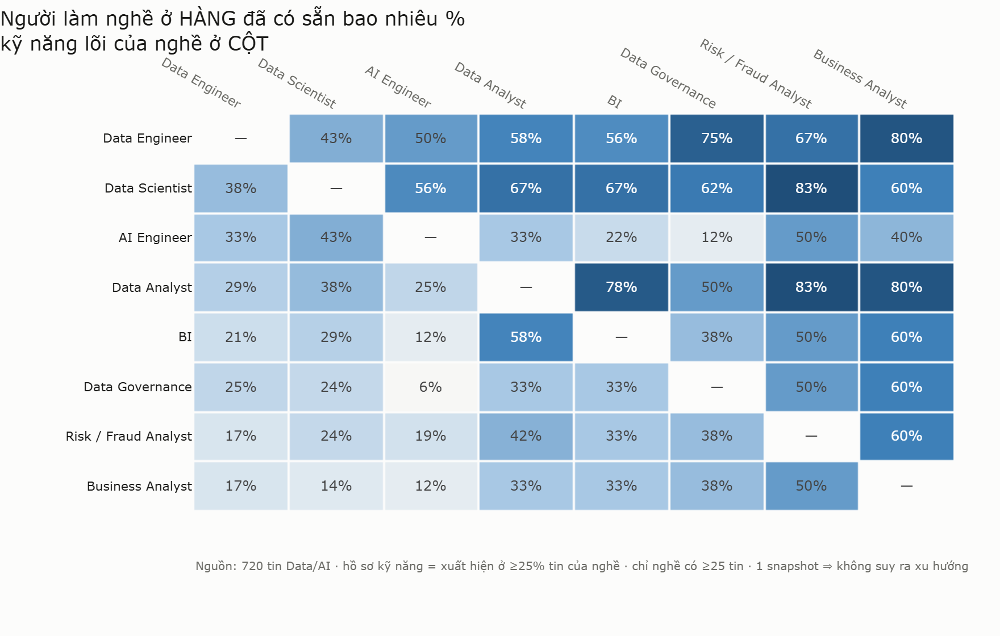

# Bản đồ chuyển nghề — Findings

*Sinh tự động bởi `python analysis/career_map.py`. Đừng sửa tay; chạy lại để cập nhật.*

## Câu hỏi

Bảng thị phần nói *nghề nào nhiều tin*. Nó không nói **"tôi nên học gì, và từ đây đi được đâu"**.
File này trả lời câu đó bằng cách so sánh **bộ kỹ năng lõi** giữa các nghề.

## Cách đo

**Hai ngưỡng, hai mục đích — đây là chỗ dễ nhầm nhất:**

| Ngưỡng | Dùng cho | Vì sao |
|---|---|---|
| **≥50%** | Bảng *"vào nghề cần gì"* | Thứ phần lớn tin tuyển dụng đòi. Danh sách ngắn, dứt khoát |
| **≥25%** | *Ma trận so sánh nghề* | Ở mức 50% hồ sơ co lại còn 1–6 kỹ năng và ma trận thành vô nghĩa — Business Analyst chỉ còn 1 kỹ năng vượt ngưỡng nên mọi ô liên quan hoá 0% hoặc 100% |

- **Độ phủ** (hàng A, cột B) = *người làm A đã có sẵn bao nhiêu % hồ sơ kỹ năng của B*.
  Công thức: `|profile(A) ∩ profile(B)| / |profile(B)|`.
- Phép này **bất đối xứng có chủ ý** — và chính sự bất đối xứng là phát hiện chính.
- Chỉ xét nghề có **≥25 tin**. Tập phân tích: **720** tin.

## Bản đồ chuyển nghề

Đọc: *người đang làm nghề ở **hàng** đã có sẵn bao nhiêu % kỹ năng lõi của nghề ở **cột***.

| Từ ↓ / Sang → | Data Engineer | Data Scientist | Ai Engineer | Data Analyst | Bi | Data Governanc | Risk Fraud Ana | Business Analy |
|---|---|---|---|---|---|---|---|---|
| **Data Engineer** | — | 43% | 50% | 58% | 56% | 75% | 67% | 80% |
| **Data Scientist** | 38% | — | 56% | 67% | 67% | 62% | 83% | 60% |
| **Ai Engineer** | 33% | 43% | — | 33% | 22% | 12% | 50% | 40% |
| **Data Analyst** | 29% | 38% | 25% | — | 78% | 50% | 83% | 80% |
| **Bi** | 21% | 29% | 12% | 58% | — | 38% | 50% | 60% |
| **Data Governance** | 25% | 24% | 6% | 33% | 33% | — | 50% | 60% |
| **Risk Fraud Analyst** | 17% | 24% | 19% | 42% | 33% | 38% | — | 60% |
| **Business Analyst** | 17% | 14% | 12% | 33% | 33% | 38% | 50% | — |

## Bộ kỹ năng tối thiểu để vào nghề

| Nghề | Số tin | Số kỹ năng lõi | Kỹ năng lõi (% tin của nghề đó yêu cầu) |
|---|--:|--:|---|
| Data Engineer | 125 | 6 | SQL 78% · Python 65% · ETL 62% · Data Management 59% · Data Warehouse 57% · Database 51% |
| Data Scientist | 31 | 6 | Data Science 77% · Machine Learning 74% · Python 71% · Statistics 71% · SQL 55% · Data Analysis 52% |
| AI Engineer | 110 | 5 | Python 81% · AI 74% · Machine Learning 74% · LLM 69% · API 56% |
| Data Analyst | 105 | 4 | Data Analysis 80% · SQL 69% · Reporting 66% · Power BI 62% |
| BI | 43 | 4 | Power BI 88% · Reporting 84% · SQL 72% · Data Analysis 67% |
| Data Governance | 27 | 2 | Data Governance 70% · Data Quality 56% |
| Risk / Fraud Analyst | 38 | 1 | Data Analysis 66% |
| Business Analyst | 146 | 1 | Business Analysis 62% |

## Xuất phát từ `Data Analyst` thì phải học thêm gì

| Sang nghề | Số kỹ năng phải học thêm | Là những gì |
|---|--:|---|
| Risk / Fraud Analyst | **1** | Data Science |
| Business Analyst | **1** | Business Analysis |
| BI | **2** | Business Intelligence, Data Modeling |
| Data Governance | **4** | Data Governance, Data Quality, Data Science, Data Warehouse |
| AI Engineer | **12** | AI, API, AWS, Cloud, Computer Vision, Deep Learning, Docker, LLM, Machine Learning, NLP, PyTorch, TensorFlow |
| Data Scientist | **13** | A/B Testing, AI, AWS, Azure, Cloud, Data Science, Deep Learning, GCP, LLM, Machine Learning, Spark, TensorFlow, scikit-learn |
| Data Engineer | **17** | API, AWS, Airflow, Big Data, CI/CD, Cloud, Data Engineering, Data Lake, Data Modeling, Data Pipeline, Data Quality, Data Warehouse, ELT, ETL, Kafka, Machine Learning, Spark |

## Thang kỹ năng theo cấp bậc

| Cấp bậc | Số tin | Số kỹ năng trung bình | Trung vị |
|---|--:|--:|--:|
| Intern | 19 | 8.3 | 7 |
| Junior | 125 | 8.2 | 7 |
| Mid | 240 | 9.8 | 8 |
| Senior | 216 | 9.9 | 8 |
| Lead | 55 | 9.4 | 9 |
| Manager | 60 | 6.2 | 5 |
| Unknown | 5 | 10.0 | 8 |

## Kiểm độ nhạy của ngưỡng — phần chống tự lừa mình

Ngưỡng 25% là một lựa chọn, không phải hằng số. Bảng dưới cho biết độ phủ đổi
bao nhiêu khi dùng 20% / 25% / 30%. **Cặp nào dao động lớn thì đừng đưa vào báo cáo
như một con số cụ thể** — chỉ nói theo hướng ("dễ / khó"), không nói theo số.

| Cặp | 20% | 25% | 30% | Dao động |
|---|---|---|---|---|
| Data Engineer → Data Governance | 100% | 75% | 50% | **50pt** |
| AI Engineer → Data Governance | 44% | 12% | 0% | **44pt** |
| Data Scientist → AI Engineer | 71% | 56% | 29% | **43pt** |
| Risk / Fraud Analyst → Data Governance | 56% | 38% | 17% | **39pt** |
| Data Engineer → AI Engineer | 62% | 50% | 29% | **33pt** |
| Data Analyst → Business Analyst | 71% | 80% | 50% | **30pt** |
| Data Engineer → Business Analyst | 57% | 80% | 50% | **30pt** |
| AI Engineer → Data Analyst | 38% | 33% | 10% | **28pt** |

### Cặp nào BỀN — chỉ những cặp này mới được trích số cụ thể

Dao động ≤ 15 điểm phần trăm qua cả ba ngưỡng:

| Cặp | 20% | 25% | 30% | Dao động |
|---|---|---|---|---|
| AI Engineer → Business Analyst | 29% | 40% | 25% | 15pt |
| Data Scientist → Risk / Fraud Analyst | 90% | 83% | 75% | 15pt |
| Data Analyst → Risk / Fraud Analyst | 90% | 83% | 75% | 15pt |
| Risk / Fraud Analyst → AI Engineer | 29% | 19% | 14% | 14pt |
| Data Engineer → Data Scientist | 56% | 43% | 50% | 14pt |
| Data Engineer → Risk / Fraud Analyst | 80% | 67% | 75% | 13pt |
| Business Analyst → Data Analyst | 31% | 33% | 20% | 13pt |
| AI Engineer → BI | 27% | 22% | 14% | 13pt |
| BI → Data Scientist | 30% | 29% | 40% | 11pt |
| Data Scientist → Data Engineer | 37% | 38% | 26% | 11pt |
| BI → Data Governance | 44% | 38% | 33% | 11pt |
| Business Analyst → Risk / Fraud Analyst | 40% | 50% | 50% | 10pt |

Các cặp còn lại **chỉ nói theo hướng** ("gần / xa", "dễ / khó"), tuyệt đối không trích con số.

Bảng đầy đủ: `analysis/outputs/career_map_sensitivity.csv`.

## Cách đọc — và cách KHÔNG được đọc

- ✅ *"Người làm A đã có sẵn phần lớn kỹ năng lõi của B"* — đúng với phép đo.
- ❌ *"Nghề A dễ hơn nghề B"* — bộ kỹ năng lõi không đo độ khó, không đo chiều sâu, không đo kinh nghiệm.
- ❌ *"Chỉ cần học N kỹ năng này là chuyển được nghề"* — đây là **danh sách kỹ năng tin tuyển dụng viết ra**,
  không phải chương trình đào tạo. Số N là *hàng rào tối thiểu*, không phải *đủ điều kiện*.
- Bảng chỉ phản ánh **những gì tin tuyển dụng viết**, không phải công việc thực tế.

## Giới hạn

- Một lát cắt duy nhất ⇒ không có phát ngôn xu hướng.
- Không có trường lương ⇒ không có phát ngôn về thu nhập.
- Tỉ lệ mô tả **tập dữ liệu này**, không phải thị trường Việt Nam — mỗi job board được truy vấn với độ
  rộng từ khoá khác nhau.
- Kỹ năng lấy từ từ điển chuẩn hoá; kỹ năng chưa có trong từ điển thì không được đếm
  (xem `data/quality/unmapped_skills.csv`).
