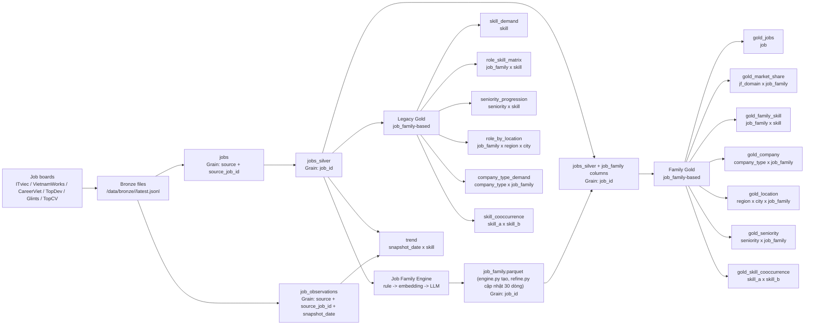

# Data Lineage

Milestone 4 deliverable: lineage from source files to warehouse serving tables.

## Evidence

- `jobs` and `job_observations` are created by `pipeline/transform/load.py`.
- `jobs_silver` is created by `pipeline/transform/silver.py`.
- Legacy Gold tables are created by `pipeline/transform/gold.py`.
- Family Gold tables are created by `job_family_engine/integrate.py`.
- `job_family.parquet (engine.py tạo, refine.py cập nhật 30 dòng)` is created by `job_family_engine/engine.py`.

